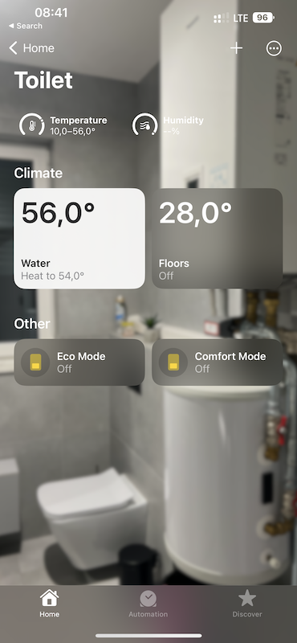

[](https://npmjs.org/package/homebridge-panasonic-heat-pump)


# homebridge-panasonic-heat-pump
Panasonic Heat Pump plugin for [HomeBridge](https://github.com/nfarina/homebridge) using the Panasonic *Comfort Cloud* API to expose Panasonic Heat Pumps to Apples HomeKit.



## Things to know
* Supports only a single Heat Pump per Comfort Cloud account
* Supports **AQUAREA** Heat Pumps only.
* Plugin implements all modes of floor heating: cooling, heating, auto (If you don't have cooling enabled in service menu, not sure if this will work)
* In case of water heating, Apple does not allow to hide *cooling* & *auto* mode. When selecting cooling, the plugin sets it to *off* and when selecting *auto*, it switches to *heating*.
* In case your water heater does not report current tank temperature, the plugin will show target temperature.

## Getting started

### Supported devices
Panasonic AQUAREA that has a cloud adapter installed

### Setup the app
1. Download, install & setup the *Panasonic Comfort Cloud* app on your mobile device
2. Create a login & add your Heat Pump to the *Comfort Cloud*

> **Caution!** It is recommended to setup another login for the *Comfort Cloud* and share your home to that login, as opposed to using your regular login for this plugin. Otherwise the *Comfort Cloud* app will log you out each time that you use this plugin (as only one user can be logged into the *Comfort Cloud* per login). If you plan to use multiple accessories, create separate accounts for every accessory. 

3. Share your login to another user setup specifically for HomeBridge.
   For instructions on how to do this, see [Sharing Panasonic heatpump with another account](README.md#Sharing-Panasonic-heatpump-with-another-account) section below.

### Sample configuration
```
{
  "platform": "PanasonicHeatPumpHomebridgePlugin",
  "email": "<YOUR_EMAIL_HERE>",
  "password": "<YOUR_PASSWORD_HERE>"
}
```

### Sharing Panasonic heatpump with another account
Panasonic really needs to improve this experience, nonetheless, here it is:
1. Create a new panasonic account here: [Panasonic ID Registration](https://csapl.pcpf.panasonic.com/Account/Register001?lang=en)
2. Verify email using the link sent to the email id specified
3. Sign into the *Panasonic Comfort Cloud* app on your smart device using the newly created *Panasonic ID*
4. Agree to the terms and conditions displayed in app
5. Agree to the privacy notice displayed in app
6. You should now be on the home screen of the App
7. Click the "+" button
8. Choose "Heat Pump"
9. Use the device ID from the original device package
10. Enter the device password you used when originally setting up the device
11. In step 3: Enter a name for the heatpump, a message="HomeBridge account" and note="HomeBridge account"
12. Click Send Request
13. Log out of the app
14. Sign in with the original email account in the Panasonic Comfort Cloud App
15. Click the Device you've requested sharing for
16. Click the hamburger menu and expand the "Owner" menu item, click "User list"
17. You should now see an id with a waiting approval status
18. Click the "Waiting Approval" button
19. Select the "Allow both monitoring and controlling heat pump" permission
20. Confirm
21. The waiting for approval button should have disappeared and replaced with a blue check icon
22. Use the newly created id in the homekit accessory configuration

### Legal
* Licensed under [MIT](LICENSE)
* This is not an official plug-in and is not affiliated with Panasonic in any way
